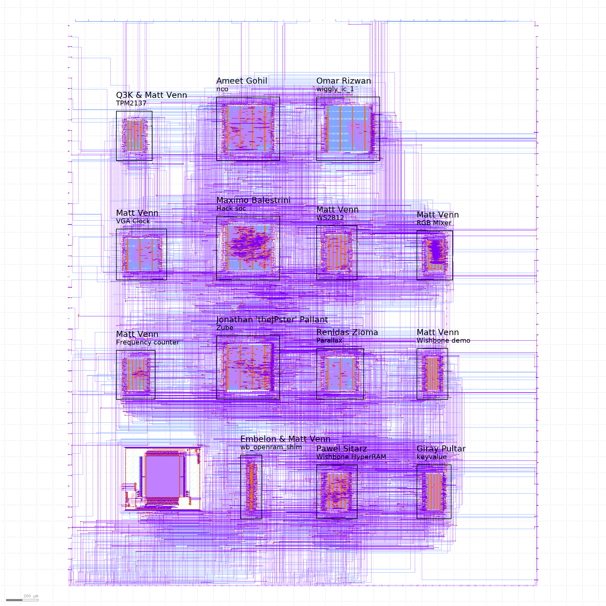
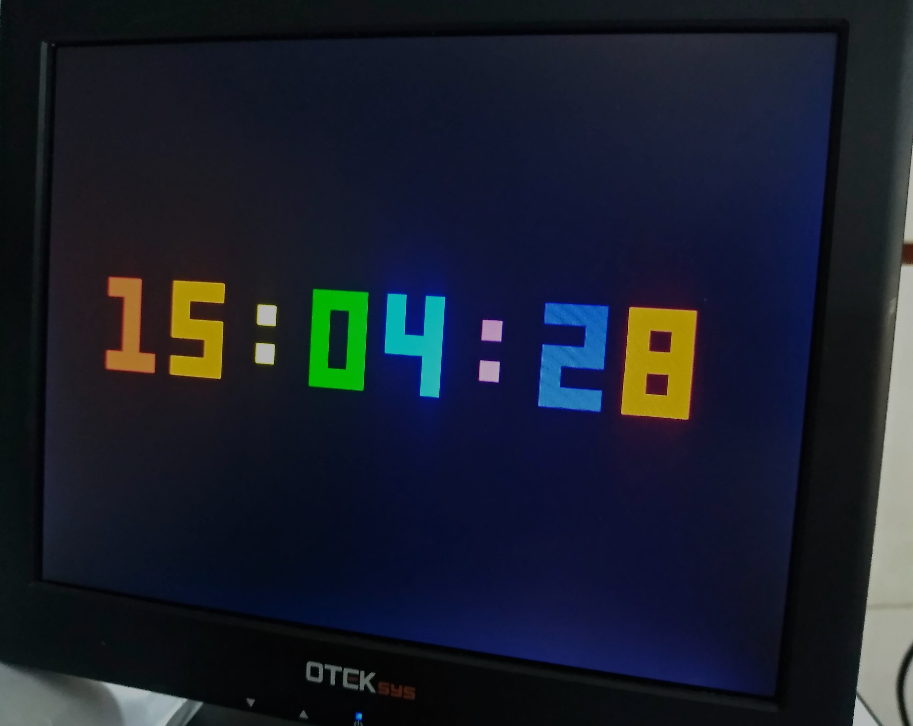
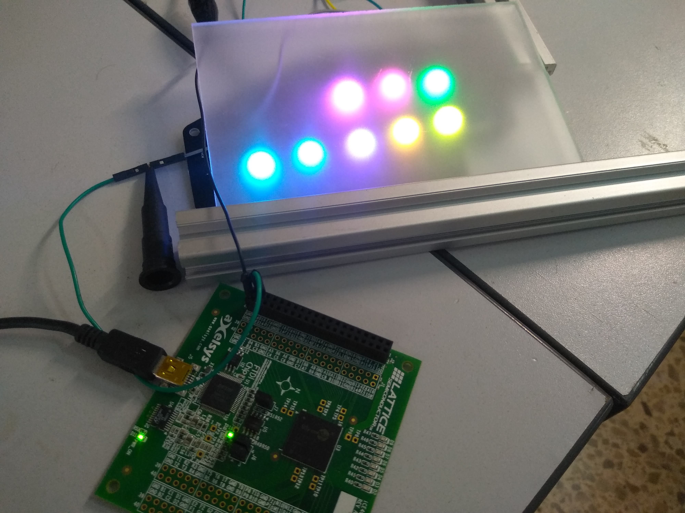
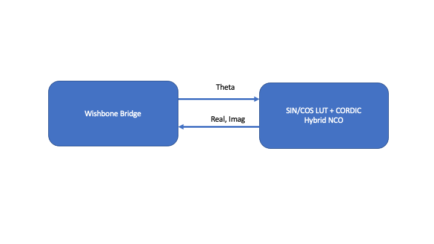
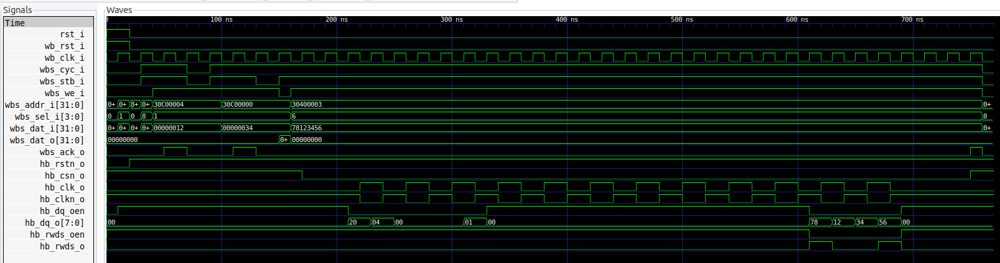
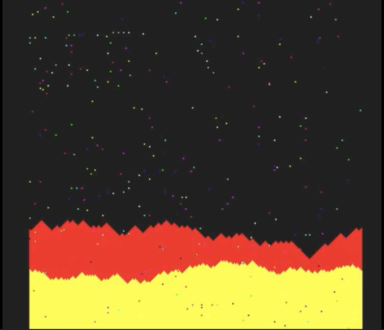
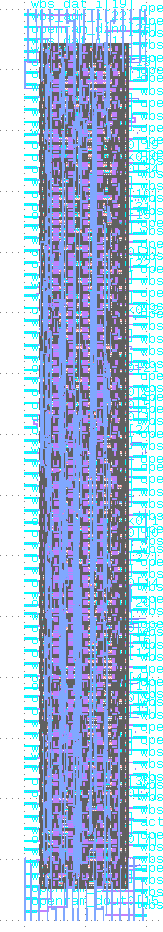
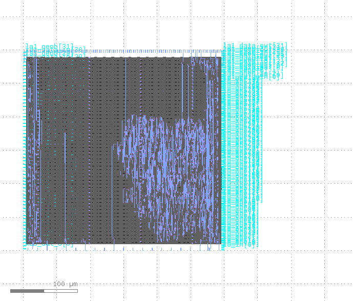
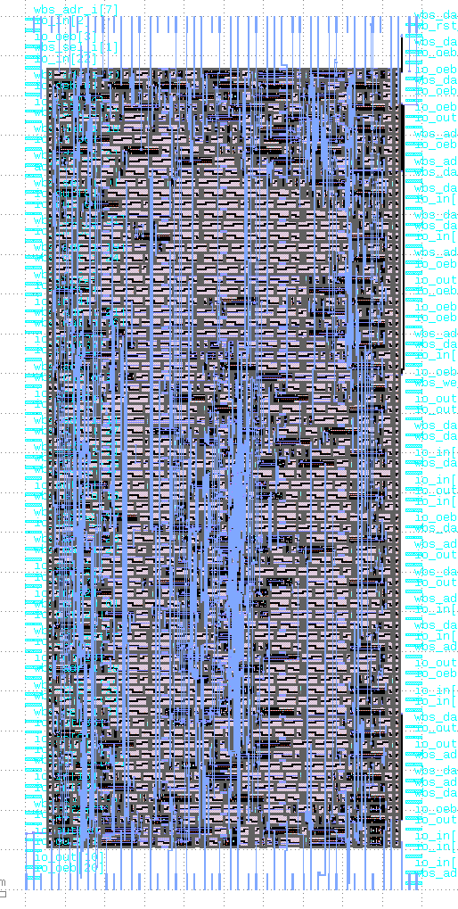
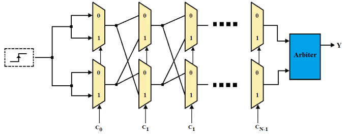

# Caravel User Project

  

# Zero to ASIC group submission MPW3

This index was made with [multi project tools](https://github.com/mattvenn/multi_project_tools)

## RGB Mixer

* Author: Matt Venn
* Github: https://github.com/mattvenn/wrapped_rgb_mixer
* commit: 1145686010fd944d47b275df29fd09becd4c9921
* Description: reads 3 encoders and generates PWM signals to drive an RGB LED

## Frequency counter

* Author: Matt Venn
* Github: https://github.com/mattvenn/wrapped_frequency_counter
* commit: 7bd1e65be1f68dfbb9cfdb7030cb6eaac4c918c9
* Description: Counts pulses on input and displays frequency on 2  seven segment displays

## VGA Clock

* Author: Matt Venn
* Github: https://github.com/mattvenn/wrapped_vga_clock
* commit: f6e76f1a54949ea69df79d3587c910b4d9d50965
* Description: shows the time on a 640x480 panel

## TPM2137

* Author: Q3K & Matt Venn
* Github: https://github.com/mattvenn/wrapped_tpm2137
* commit: 9edfe316ae8f9d618a3dd9cee5bc10c1bead0c9b
* Description: CTF by Q3K - turn on the green light by sending the right code

## WS2812

* Author: Matt Venn
* Github: https://github.com/mattvenn/wrapped_ws2812
* commit: dd4050fceea5944e5dd72b6021d1e5f7794ca933
* Description: WS2812 LED driver

## Zube

* Author: Jonathan 'theJPster' Pallant
* Github: https://github.com/thejpster/zube_submission
* commit: bc9b493ed900bd91b5296adfe1cae6b9e28c41d2
* Description: A generic Z80 bus peripheral

## Hack soc

* Author: Maximo Balestrini
* Github: https://github.com/mbalestrini/wrapped_hack_soc
* commit: 009a903f28b54a620bedea825d59de13c468f51a
* Description: Hardware implementation of the Hack Computer from the Nand to Tetris courses

## nco

* Author: Ameet Gohil
* Github: https://github.com/ameetgohil/mpw3-nco
* commit: 6050985fcc44fba61af68cbc01c7a8e40f0a61dc
* Description: generates signed sin and cos outputs given an angle accessible via wishbone

## Wishbone HyperRAM

* Author: Pawel Sitarz
* Github: https://github.com/embelon/wrapped_wb_hyperram
* commit: 123a4492dcc7f34b48f3dc15fce74d976ac33181
* Description: Simple HyperRAM driver accesible on Wishbone bus

## Parallax

* Author: Renldas Zioma
* Github: https://github.com/rejunity/zero-to-asic-wrapped-parallax
* commit: 6a1771bbd54b0b929915f121982e533b3b1df68c
* Description: Scrolling procedural background using several LFSRs. VGA 640x480@70hz

## wb_openram_shim

* Author: Embelon & Matt Venn
* Github: https://github.com/embelon/wrapped_wb_openram_shim
* commit: a01934627c1a6ee9288ff7b47ffe1e4e97b0554f
* Description: Wrapped version of Wishbone OpenRam Shim/Wrapper

## wiggly_ic_1

* Author: Omar Rizwan
* Github: https://github.com/osnr/wrapped_wiggly_ic_1
* commit: ed5fca687ae598f7ffa74c59872c585ec1a5511e
* Description: screen and mouse; interact

## keyvalue

* Author: Giray Pultar
* Github: https://github.com/giraypultar/wrapped_keyvalue
* commit: ad6e31697aa661e1383f01f9b03817681704cc5e
* Description: key value store

## Wishbone demo

* Author: Matt Venn
* Github: https://github.com/mattvenn/wrapped_wishbone_demo
* commit: 8c1784235533a486dd6c754bfd2c62fade0896f9
* Description: Wishbone buttons & LEDS

## OpenPUF

* Author: Pedro Rivera
* Github: https://github.com/pedrorivera/wrapped_OpenPUF
* commit: eec589a456a3f603e97aa1647ae8dca453f612d8
* Description: A delay-based physically-unclonable function (PUF) proof of concept

