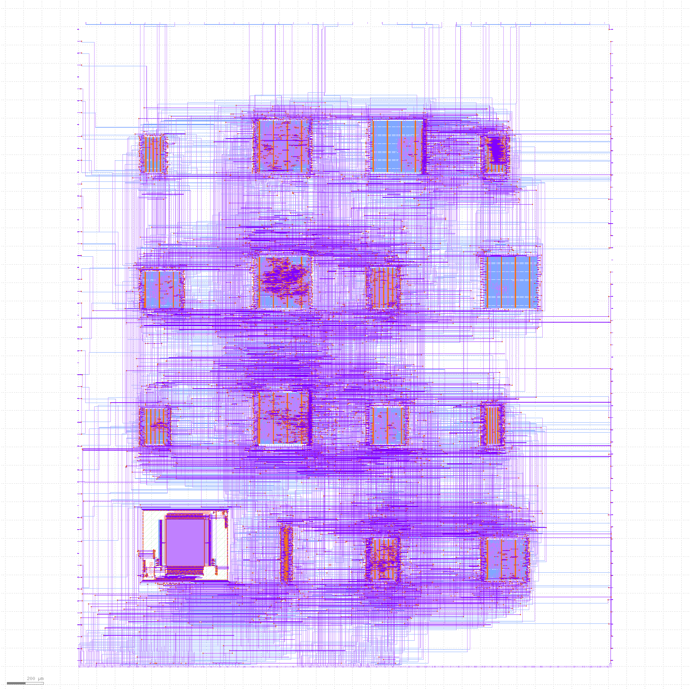

# Caravel User Project

  

# Zero to ASIC group submission MPW3

This index was made with [multi project tools](https://github.com/mattvenn/multi_project_tools)

## RGB Mixer

* Author: Matt Venn
* Github: https://github.com/mattvenn/wrapped_rgb_mixer
* commit: mpw3
* Description: reads 3 encoders and generates PWM signals to drive an RGB LED

## Frequency counter

* Author: Matt Venn
* Github: https://github.com/mattvenn/wrapped_frequency_counter
* commit: mpw3
* Description: Counts pulses on input and displays frequency on 2  seven segment displays

## VGA Clock

* Author: Matt Venn
* Github: https://github.com/mattvenn/wrapped_vga_clock
* commit: main
* Description: shows the time on a 640x480 panel

